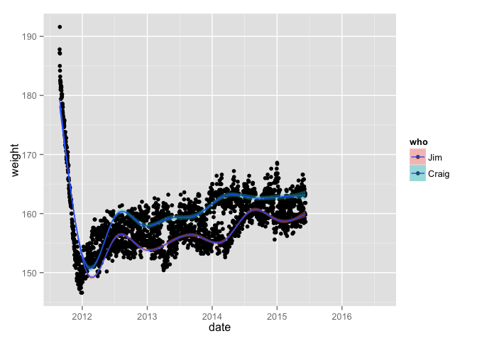

------------------------------------------------------------------------

Outline of 2015-06-10 `googlesheets` Practice Talk
--------------------------------------------------

Visit the [README](README.md)

### Install and load googlesheets

Putting here just for completeness, even though we won't go hands on so soon, I bet.

``` r
devtools::install_github("jennybc/googlesheets")
```

I will go ahead and load `googlesheets` and `dplyr` (latter mostly for `%>%`).

``` r
library("googlesheets")
suppressPackageStartupMessages(library("dplyr"))
```

### Women in macroecology

Tweet from this morning (actually from December but I saw a retweet today):

<blockquote class="twitter-tweet" lang="en">
<p lang="en" dir="ltr">
I'm making a women in macroecology list. Please add yourself &/or others! Keen to find students, postdocs & PIs. <a href="https://t.co/PfgJXZ1d8G">https://t.co/PfgJXZ1d8G</a>
</p>
— Natalie Cooper (@nhcooper123) <a href="https://twitter.com/nhcooper123/status/545197476454879233">December 17, 2014</a>
</blockquote>
So let's visit that Sheet!

<https://docs.google.com/spreadsheets/d/1jmTR4-qNgdKpmKLCSfadIXF2zYNo4jlVHb7YMjnY-os>

And get it into R!

``` r
the_url <- "https://docs.google.com/spreadsheets/d/1jmTR4-qNgdKpmKLCSfadIXF2zYNo4jlVHb7YMjnY-os"
wm <- gs_url(the_url, lookup = FALSE)
#> Sheet-identifying info appears to be a browser URL.
#> googlesheets will attempt to extract sheet key from the URL.
#> Putative key: 1jmTR4-qNgdKpmKLCSfadIXF2zYNo4jlVHb7YMjnY-os
#> Authentication will not be used.
#> Worksheets feed constructed with public visibility
```

Let's get an overview

``` r
wm
#>                   Spreadsheet title: Women in Macroecology
#>   Date of googlesheets registration: 2015-06-10 22:00:18 GMT
#>     Date of last spreadsheet update: 2015-06-10 19:44:45 GMT
#>                          visibility: public
#>                         permissions: rw
#>                             version: new
#> 
#> Contains 1 worksheets:
#> (Title): (Nominal worksheet extent as rows x columns)
#> Sheet1: 1011 x 27
#> 
#> Key: 1jmTR4-qNgdKpmKLCSfadIXF2zYNo4jlVHb7YMjnY-os
```

Often not so helpful. Let's read data from the sheet.

``` r
wm_dat <- wm %>%
  gs_read()
#> Accessing worksheet titled "Sheet1"
wm_dat
#> Source: local data frame [133 x 7]
#> 
#>                   Name
#> 1                     
#> 2     Adriana de Palma
#> 3        Aimee Classen
#> 4          Aletta Bonn
#> 5         Alison Boyer
#> 6       Allison Barner
#> 7       Amanda E Bates
#> 8  Ana Rosa Gomez Cano
#> 9           Ana Santos
#> 10      Andrea Baquero
#> ..                 ...
#> Variables not shown: Student.Postdoc.Fellow.PI (chr),
#>   Country.they.are.based.in (chr), General.topic (chr), Email (chr), Tel
#>   (lgl), Website (chr)
## let's get rid of the UN-TIDY 2nd row :(
wm_dat <- wm_dat[-1, ]
#wm_dat %>% View
```

And we'll summarize entries by `Student/Postdoc/Fellow/PI`:

``` r
wm_dat %>%
  count(Student.Postdoc.Fellow.PI)
#> Source: local data frame [7 x 2]
#> 
#>   Student.Postdoc.Fellow.PI  n
#> 1                    Fellow  5
#> 2 Fellow, Fulbright Scholar  1
#> 3                        PI 34
#> 4               PhD Student  2
#> 5                   Postdoc 29
#> 6                   Student 57
#> 7                   student  4
```

Sidebar: now you see why you should use a [Google Form](https://www.google.com/forms/about/) or [data validation](https://support.google.com/docs/answer/139705?hl=en), right? Never let people just type what comes into their heart :)

### Major League Ultimate

Game video: [2014 MLU Championship: DC Current vs Vancouver Nighthawks](https://www.youtube.com/watch?v=s8VWLIhn_g0&t=2h16m08s)

Example Google Sheet for capturing live play in real time: <https://docs.google.com/spreadsheets/d/15DlGxGBZu_hbMPr5tVik9RcSCn6F9PxepTgjpOvZnOg>

which I then process to produce live webpage during games:
<http://www.stat.ubc.ca/~jenny/notOcto/vanNH/vanNH_nowPlaying.html>
(*please don't look too closely at how I do this because it's accumulated result of panic coding on game days, i.e. every two weeks during the season; lots of horrible code*)

### Jim and Craig weight loss

> The following sets for the terms for Jim's and Craig's weight loss bet:

> Craig starting weight: 191.6
> Jim starting weight: 187.8

> Final weigh-in date: the 2nd morning that Craig spends in Vancouver (assuming the Norrises visit the Bryans during the week between Christmas and New Year's 2012) or December 28, 2011 (if no such visit occurs)

> Final weight equals the average of the seven daily weigh-ins ending on the final weigh-in date. Daily weigh-ins (except as set forth below) shall occur within five minutes of getting out of bed in the morning, and each participant is permitted to urinate, defecate, expectorate, vomit or perform any other bodily function so desired during that period. Once a week (generally on a Saturday or Sunday), the participants shall report their morning weigh-in to each other. The final daily weigh-in (in the event the Norrises and the Bryans are together) shall occur within ten minutes of both participants waking up. The final weigh-ins shall be reported along with accompanying photographic evidence. In the event either participant fails to conduct a proper weigh-in during any of the final seven days, then the weigh-in for that date shall be the average of the remaining proper weigh-ins plus one pound for each improperly weighed day (e.g., if Craig forgets to weigh himself on Christmas and Christmas Eve, then his weight for each of those days is the average of the remaining five days plus two pounds).

> The participant who loses the most weight (as measured by the final weight as a percentage of his starting weight) shall be declared the winner.

> The loser shall fly to the winner's home city and stay with the winner for at least one full day (the "Butler Day") on a mutually agreed date in 2012. At the winner's option, the Butler Day can be either a Friday or a Saturday. On the Butler Day, the loser (the "Butler") shall serve as the butler for the winner (the "Master") for a consecutive 14-hour period of the Master's choosing (no earlier than 6am). During that time, the Butler shall perform any and all services for the Master that the Master desires; provided, however, that the Butler shall not be required to perform any illegal or immoral acts, sexual favors, feats of extreme endurance or any other service deemed unreasonable by each of the participants' spouses. Examples of permitted services include, but are not limited to, cooking, gardening, handiwork, caddying, office work, serving food and drinks or running errands. On the Butler Day, the Butler shall wear suitable attire for the services performed, as requested by the Master; provided, however, that any special clothes or attire not already owned by the Butler shall be purchased by the Master; and, provided, further, that the Butler shall not be required to wear any attire that is not appropriate for the services performed or is otherwise intended solely to humiliate the Butler (as determined by the spouses). The Butler shall perform the requested services cheerfully and with minimal complaining.

Let's look at the sheet:
<https://docs.google.com/spreadsheets/d/1jFzYEbrKJvZ20pSqup-2Kcvh-fc_D9aI9WkpTd_hyw8>

Let's register the sheet:

``` r
the_url <- "https://docs.google.com/spreadsheets/d/1jFzYEbrKJvZ20pSqup-2Kcvh-fc_D9aI9WkpTd_hyw8"
wl <- gs_url(the_url, lookup = FALSE)
#> Sheet-identifying info appears to be a browser URL.
#> googlesheets will attempt to extract sheet key from the URL.
#> Putative key: 1jFzYEbrKJvZ20pSqup-2Kcvh-fc_D9aI9WkpTd_hyw8
#> Authentication will not be used.
#> Worksheets feed constructed with public visibility
wl
#>                   Spreadsheet title: Weight Data
#>   Date of googlesheets registration: 2015-06-10 22:00:20 GMT
#>     Date of last spreadsheet update: 2015-05-19 16:57:04 GMT
#>                          visibility: public
#>                         permissions: rw
#>                             version: new
#> 
#> Contains 3 worksheets:
#> (Title): (Nominal worksheet extent as rows x columns)
#> Raw data: 1805 x 21
#> Recent data: 1000 x 26
#> Final score: 100 x 20
#> 
#> Key: 1jFzYEbrKJvZ20pSqup-2Kcvh-fc_D9aI9WkpTd_hyw8
```

``` r
wl_dat <- wl %>% 
  gs_read(range = cell_cols("A:C"))
#> Accessing worksheet titled "Raw data"
wl_dat
#> Source: local data frame [1,804 x 3]
#> 
#>         date   Jim Craig
#> 1  8/27/2011 187.8 187.2
#> 2  8/28/2011 185.0 191.6
#> 3  8/29/2011 184.2 187.1
#> 4  8/30/2011 183.2 182.6
#> 5  8/31/2011 182.0 182.4
#> 6   9/1/2011 181.0 182.4
#> 7   9/2/2011 181.4 182.2
#> 8   9/3/2011 179.4 181.6
#> 9   9/4/2011 181.0 181.4
#> 10  9/5/2011 181.0 181.6
#> ..       ...   ...   ...

library(ggplot2)
library(tidyr)

wl_dat <- wl_dat %>% 
  mutate(date = as.Date(date, format = "%m/%d/%Y"))
wl_dat_tidy <- wl_dat %>%
  gather("who", "weight", Jim, Craig)
p <- ggplot(wl_dat_tidy, aes(x = date, y = weight, fill = who))
p + geom_point() + geom_smooth()
#> Warning in loop_apply(n, do.ply): Removed 420 rows containing missing
#> values (stat_smooth).
#> Warning in loop_apply(n, do.ply): Removed 420 rows containing missing
#> values (stat_smooth).
#> Warning in loop_apply(n, do.ply): Removed 840 rows containing missing
#> values (geom_point).
```



### Here are some draft slides

[Draft slides](https://speakerdeck.com/jennybc/googlesheets-draft) for a talk in July 2015

### Shiny

**Draft** [README](inst/shiny-examples/README.md) for some **draft-and-not-completely-working** Shiny apps.
