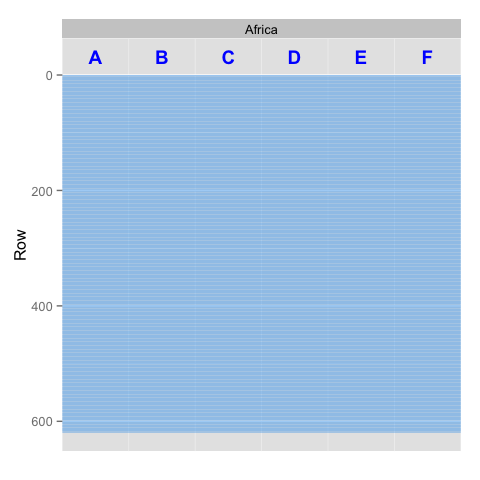

<!-- README.md is generated from README.Rmd. Please edit that file -->
**Not quite ready for showtime but release coming very soon!**
--------------------------------------------------------------

Google Spreadsheets R API
-------------------------

[](https://travis-ci.org/jennybc/gspreadr)

Manage your spreadsheets with *gspreadr* in R.

*gspreadr* is patterned after [gspread](https://github.com/burnash/gspread), a Google Spreadsheets Python API

Features:

-   Open a spreadsheet by its **title** or **url**.
-   Extract range, entire row or column values.


Basic Usage
-----------

``` r
library(gspreadr)
```

``` r
# See what spreadsheets you have
list_spreadsheets()

# Open a worksheet from spreadsheet with one shot
ws <- open_at_once("Temperature", "Sheet1")

update_cell(ws, "B2", "January")

# Fetch a cell range
df <- read_range(ws, "A1:B7")
```

Authorization
-------------

##### Authorization using OAuth2 (recommended)

``` r
# Give gspreadr permission to access your spreadsheets and google drive
authorize() 
```

##### Alternate authorization: login with your Google account

``` r
login("my_email", "password")
```

More Examples
-------------

### Opening a spreadsheet

``` r
# You can open a spreadsheet by its title as it appears in Google Drive
ssheet <- open_spreadsheet("Gapminder")
```

##### Usually for public spreadsheets (set visibility = "public" for public spreadsheets):

``` r
# Open a spreadsheet by its key 
ssheet <- open_by_key("1hS762lIJd2TRUTVOqoOP7g-h4MDQs6b2vhkTzohg8bE")

# You can also use the entire URL
ssheet <- open_by_url("https://docs.google.com/spreadsheets/d/1hS762...")
```

``` r
# See the structure
str(ssheet)
#> Spreadsheet:
#> Gapminder: 5 worksheets
#> 
#> Worksheets:
#> Africa : 619 rows and 6 columns
#> Americas : 301 rows and 6 columns
#> Asia : 397 rows and 6 columns
#> Europe : 361 rows and 6 columns
#> Oceania : 25 rows and 6 columns
```

### Creating and Deleting a spreadsheet

``` r
# Create a new spreadsheet by title
add_spreadsheet("New Spreadsheet")

# Move spreadsheet to trash
del_spreadsheet("New Spreadsheet")
```

### Opening a worksheet

``` r

# Get a list of all worksheets
list_worksheets(ssheet)
#> [1] "Africa"   "Americas" "Asia"     "Europe"   "Oceania"

# You can open a worksheet by index. Worksheet indexes start from one.
ws <- open_worksheet(ssheet, 1)

# By title
ws <- open_worksheet(ssheet, "Africa")

# See the structure
str(ws)
#> Worksheet
#> Africa : 619 rows and 6 columns
#>   Column Label Rows Empty.Cells Missing Runs
#> 1      1     A  619           0       0 619V
#> 2      2     B  619           0       0 619V
#> 3      3     C  619           0       0 619V
#> 4      4     D  619           0       0 619V
#> 5      5     E  619           0       0 619V
#> 6      6     F  619           0       0 619V
```

### Viewing a worksheet

``` r
# Take a peek at your worksheet
view(ws)
```



``` r
# Take a peek at all the worksheets in the spreadsheet
view_all(ssheet)
```


### Creating and Deleting a worksheet

``` r
# Create a new worksheet
add_worksheet(ssheet, title = "foo", rows = 10, cols = 10)

# Delete worksheet
new_ws <- open_worksheet(ssheet, "foo")
del_worksheet(new_ws)
```

### Renaming a worksheet

``` r
rename_worksheet(ssheet, old_title = "Old Name", new_title = "Cooler Name")
```

### Getting all values from a row or range of rows

``` r
get_row(ws, 3)
#> [1] "Angola"    "Africa"    "2007"      "42.731"    "12420476"  "4797.2313"

get_rows(ws, from = 2, to = 5, header = TRUE)
#>    Algeria Africa 2007 72.301 33333216  6223.3675
#> 1   Angola Africa 2007 42.731 12420476  4797.2313
#> 2    Benin Africa 2007 56.728  8078314  1441.2849
#> 3 Botswana Africa 2007 50.728  1639131 12569.8518
```

### Getting all values from a column or range of columns

``` r
one_col <- get_col(ws, 1)

many_cols <- get_cols(ws, from_col = 1, to_col = 3)
```

### Getting a region of a worksheet

``` r

# By boundary rows and cols
read_region(ws, from_row = 1, to_row = 5, from_col = 1, to_col = 6)
#>    country continent year lifeExp      pop  gdpPercap
#> 1  Algeria    Africa 2007  72.301 33333216  6223.3675
#> 2   Angola    Africa 2007  42.731 12420476  4797.2313
#> 3    Benin    Africa 2007  56.728  8078314  1441.2849
#> 4 Botswana    Africa 2007  50.728  1639131 12569.8518

# By range
read_range(ws, "A1:F5")
#>    country continent year lifeExp      pop  gdpPercap
#> 1  Algeria    Africa 2007  72.301 33333216  6223.3675
#> 2   Angola    Africa 2007  42.731 12420476  4797.2313
#> 3    Benin    Africa 2007  56.728  8078314  1441.2849
#> 4 Botswana    Africa 2007  50.728  1639131 12569.8518
```

### Getting the entire worksheet

``` r
all_my_data <- read_all(ws)
```

### Getting all worksheets from a spreadsheet as a list of worksheet objects

``` r
my_ws <- open_worksheets(ssheet)
```

### Getting a cell value

``` r
# With label
get_cell(ws, "B2")
#> [1] "Africa"

# With coordinates
get_cell(ws, "R2C2")
#> [1] "Africa"
```

### Finding cells

``` r
# find a cell with value (cell of first appearance)
find_cell(ws, "Algeria")
#> [1] "Cell R2C1, A2"

# find all cells with value
find_all(ws, "Algeria")
#>    Label  Coord     Val
#> 1     A2   R2C1 Algeria
#> 2    A54  R54C1 Algeria
#> 3   A105 R105C1 Algeria
#> 4   A157 R157C1 Algeria
#> 5   A208 R208C1 Algeria
#> 6   A260 R260C1 Algeria
#> 7   A311 R311C1 Algeria
#> 8   A363 R363C1 Algeria
#> 9   A414 R414C1 Algeria
#> 10  A466 R466C1 Algeria
#> 11  A517 R517C1 Algeria
#> 12  A569 R569C1 Algeria
```

### Updating cells

``` r
# update a single cell
update_cell(ws, "B4", "Oops")

get_cell(ws, "B4")

# Update cells in batch - specify range
update_cells(ws, "A1:C1", c("Country", "Continent", "Year"))

read_range(ws, "A1:C1")

# Update cells in batch - specify anchor cell
update_cells(ws, "D1", c("Life Expectancy", "Population", "GDP Per Capita"))

read_range(ws, "D1:F1")
```
