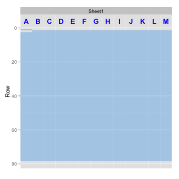
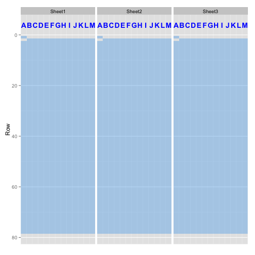

**Not quite ready for showtime but release coming very soon!**
---

Google Spreadsheets R API
---

Manage your spreadsheets with *gspreadr* in R. 

*gspreadr* is patterned after [gspread](https://github.com/burnash/gspread), a Google Spreadsheets Python API


Features:

-   Open a spreadsheet by its **title** or **url**.
-   Extract range, entire row or column values.


Basic Usage
---

```r
library(gspreadr)
```

```r
# See what spreadsheets you have
list_spreadsheets()

# Open a worksheet from spreadsheet with one shot
ws <- open_at_once("Temperature", "Sheet1")

update_cell(ws, "B2", "January")

# Fetch a cell range
df <- read_range(ws, "A1:B7")
```

Authorization
---
##### Authorization using OAuth2 (recommended)

```r
# Give gspreadr permission to access your spreadsheets and google drive
authorize() 
```

##### Alternate authorization: login with your Google account


```r
login("my_email", "password")
```
  
More Examples
---
### Opening a spreadsheet


```r
# You can open a spreadsheet by its title as it appears in Google Drive
ssheet <- open_spreadsheet("Temperature")

# See the structure
str(ssheet)
```

```
## Spreadsheet:
## Temperature: 3 worksheets
## 
## Worksheets:
## Sheet1 : 78 rows and 13 columns
## Sheet2 : 78 rows and 13 columns
## Sheet3 : 78 rows and 13 columns
```

##### Usually for public spreadsheets (set visibility = "public" for public spreadsheets): 

```r
# Open a spreadsheet by its key 
ssheet <- open_by_key("1GLsDOyR8hDgkjC6fzaDCVVjYsN8tLvnySDayk3HfxxA")

# You can also use the entire URL
ssheet <- open_by_url("https://docs.google.com/spreadsheets/d/1WNUDoBb...")
```

### Creating and Deleting a spreadsheet


```r
# Create a new spreadsheet by title
add_spreadsheet("New Spreadsheet")

# Move spreadsheet to trash
del_spreadsheet("New Spreadsheet")
```

### Opening a worksheet


```r
# Get a list of all worksheets
list_worksheets(ssheet)
```

```
## [1] "Sheet1" "Sheet2" "Sheet3"
```

```r
# You can open a worksheet by index. Worksheet indexes start from one.
ws <- open_worksheet(ssheet, 1)

# By title
ws <- open_worksheet(ssheet, "Sheet1")

# See the structure
str(ws)
```

```
## Worksheet
## Sheet1 : 78 rows and 13 columns
##    Column Label Rows Empty.Cells Missing         Runs
## 1       1     A   78           1    0.01 1V, 1NA, 76V
## 2       2     B   78           1    0.01     1NA, 77V
## 3       3     C   78           1    0.01     1NA, 77V
## 4       4     D   78           1    0.01     1NA, 77V
## 5       5     E   78           1    0.01     1NA, 77V
## 6       6     F   78           1    0.01     1NA, 77V
## 7       7     G   78           1    0.01     1NA, 77V
## 8       8     H   78           1    0.01     1NA, 77V
## 9       9     I   78           1    0.01     1NA, 77V
## 10     10     J   78           1    0.01     1NA, 77V
## 11     11     K   78           1    0.01     1NA, 77V
## 12     12     L   78           1    0.01     1NA, 77V
## 13     13     M   78           1    0.01     1NA, 77V
```

### Viewing a worksheet

```r
# Take a peek at your worksheet
view(ws)
```

 

```r
# Take a peek at all the worksheets in the spreadsheet
view_all(ssheet)
```

 

### Creating and Deleting a worksheet


```r
# Create a new worksheet
add_worksheet(ssheet, title = "foo", rows = 10, cols = 10)

# Delete worksheet
new_ws <- open_worksheet(ssheet, "foo")
del_worksheet(new_ws)
```

### Renaming a worksheet


```r
rename_worksheet(ssheet, old_title = "Old Name", new_title = "Cooler Name")
```

### Getting all values from a row or range of rows


```r
get_row(ws, 3)
```

```
##  [1] "1937" "-3.8" "2"    "7.3"  "8.4"  "11.5" "15.3" "17.1" "15.7" "13.9"
## [11] "10.8" "6.5"  "4"
```

```r
get_rows(ws, from = 2, to = 5, header = TRUE)
```

```
##     NA  Jan Feb Mar Apr  May  Jun  Jul  Aug  Sep  Oct Nov Dec
## 1 1937 -3.8   2 7.3 8.4 11.5 15.3 17.1 15.7 13.9 10.8 6.5   4
## 2 1938  3.3   4   6 9.2 11.8 15.3 17.5   16 14.9   10 4.5 3.3
## 3 1939  4.6 2.2 5.6   9 12.5 13.9 16.4 17.3 13.7  9.8 8.9   7
```

### Getting all values from a column or range of columns

```r
one_col <- get_col(ws, 1)

many_cols <- get_cols(ws, from_col = 1, to_col = 3)
```

### Getting a region of a worksheet

```r
# By boundary rows and cols
read_region(ws, from_row = 2, to_row = 5, from_col = 2, to_col = 13)
```

```
##    Jan Feb Mar Apr  May  Jun  Jul  Aug  Sep  Oct Nov Dec
## 1 -3.8   2 7.3 8.4 11.5 15.3 17.1 15.7 13.9 10.8 6.5   4
## 2  3.3   4   6 9.2 11.8 15.3 17.5   16 14.9   10 4.5 3.3
## 3  4.6 2.2 5.6   9 12.5 13.9 16.4 17.3 13.7  9.8 8.9   7
```

```r
# By range
read_range(ws, "B2:M5")
```

```
##    Jan Feb Mar Apr  May  Jun  Jul  Aug  Sep  Oct Nov Dec
## 1 -3.8   2 7.3 8.4 11.5 15.3 17.1 15.7 13.9 10.8 6.5   4
## 2  3.3   4   6 9.2 11.8 15.3 17.5   16 14.9   10 4.5 3.3
## 3  4.6 2.2 5.6   9 12.5 13.9 16.4 17.3 13.7  9.8 8.9   7
```

### Getting the entire worksheet

```r
all_my_data <- read_all(ws)
```

### Getting all worksheets from a spreadsheet as a list of worksheet objects

```r
my_ws <- open_worksheets(ssheet)
```

### Getting a cell value


```r
# With label
get_cell(ws, "B2")
```

```
## [1] "Jan"
```

```r
# With coordinates
get_cell(ws, "R2C2")
```

```
## [1] "Jan"
```

### Finding cells

```r
# find a cell with value (cell of first appearance)
find_cell(ws, "Jan")
```

```
## [1] "Cell R2C2, B2"
```

```r
# find all cells with value
find_all(ws, "10")
```

```
##   Label  Coord Val
## 1    K4  R4C11  10
## 2   E46  R46C5  10
## 3   E59  R59C5  10
## 4   K67 R67C11  10
## 5   K72 R72C11  10
## 6   K74 R74C11  10
## 7   K75 R75C11  10
```

### Updating cells 

```r
# update a single cell
update_cell(ws, "B4", "2.0")

get_cell(ws, "B4")
```

```
## [1] "2"
```

```r
# Update cells in batch - specify range
update_cells(ws, "B2:C2", c("January", "February"))

read_range(ws, "B2:C2")
```

```
##        V1       V2
## 1 January February
```

```r
# Update cells in batch - specify anchor cell
update_cells(ws, "D2", c("March", "April", "May"))

read_range(ws, "B2:F2")
```

```
##        V1       V2    V3    V4  V5
## 1 January February March April May
```


