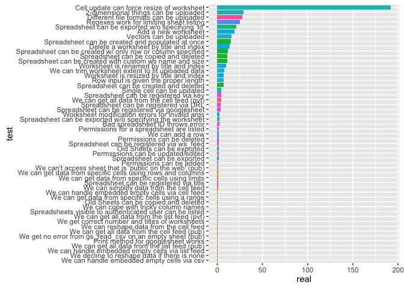

# Find out which tests are so slow
Jenny Bryan  


```r
library("plyr")
library("dplyr")
```

```
## 
## Attaching package: 'dplyr'
## 
## The following objects are masked from 'package:plyr':
## 
##     arrange, count, desc, failwith, id, mutate, rename, summarise,
##     summarize
## 
## The following objects are masked from 'package:stats':
## 
##     filter, lag
## 
## The following objects are masked from 'package:base':
## 
##     intersect, setdiff, setequal, union
```

```r
library("ggplot2")
library("testthat")

## damn you render and your hard-wiring of wd = dir where file lives!
## if I don't commit this abomination, existing .httr-oauth cannot be found :(
if (basename(getwd()) == "internal-projects") {
  setwd("..")
}

devtools::load_all()
```

```
## Loading googlesheets
```

```r
foo <- test_dir("tests/testthat/")
```

```
## authorization : .......
## edit cells : .................................
## cell range specification : .....
## consume data with private visibility : ...
## create, delete, copy sheets : .........................S.
## download sheets : ..............S
## list sheets : ......
## permissions : ...............
## register sheets : ...........
## upload sheets : .....
## inspect data frames : .....
## utility functions : ....................
## edit worksheets : ........................................
## suspend authorization : ...
## consume data with public visibility, selectively : .................................
## consume tricky data : ..............................
## consume data with public visibility, whole sheets : ................
```

```
## Auto-refreshing stale OAuth token.
```

```
## 
## DONE
```

```r
tdat <- ldply(foo, function(x)
  data_frame(file = x$file, context = x$context, test = x$test,
             user = x$user, system = x$system, real = x$real))

tdat <- tdat %>%
  arrange(desc(real)) %>%
  filter(min_rank(real) > 20) %>%
  mutate(test = factor(test, levels = rev(test)))

p <- ggplot(tdat, aes(x = test, y = real, fill = context))
p + geom_bar(stat = "identity") + coord_flip() +
  guides(fill = FALSE)
```

 


---
title: "06_why-are-tests-so-slow.R"
author: "jenny"
date: "Sat Oct 24 22:04:50 2015"
---
