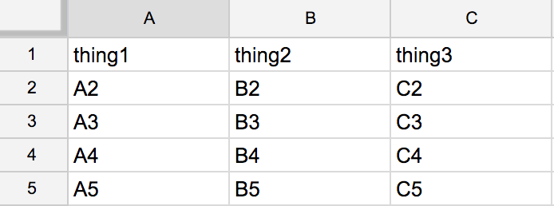
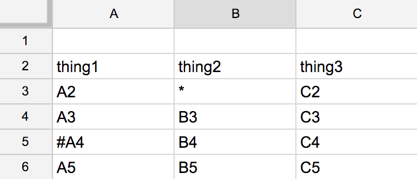

```{r, echo = FALSE}
NOT_CRAN <- identical(tolower(Sys.getenv("NOT_CRAN")), "true")
knitr::opts_chunk$set(
  collapse = TRUE,
  comment = "#>",
  purl = NOT_CRAN,
  eval = NOT_CRAN
)
## this is nice during development = on github
## this is not so nice for preparing vignettes for CRAN
#options(knitr.table.format = 'markdown')
```

First we load the `googlesheets` package and `dplyr`, from which we use the `%>%` pipe operator, among other things. `googlesheets` usage *does not require* you to use `%>%` though it was certainly designed to be pipe-friendly. This vignette uses pipes but you will find that all the examples in the help files use base R only.

```{r load-package}
library(googlesheets)
suppressMessages(library(dplyr))
```

```{r auth, include = FALSE}
## I grab the token from the testing directory because that's where it is to be
## found on Travis
token_path <- rprojroot::find_package_root_file(
  "tests", "testthat", "googlesheets_token.rds"
)
suppressMessages(googlesheets::gs_auth(token = token_path, verbose = FALSE))
```

```{r pre-clean, include = FALSE}
## in case a previous compilation of this document exited uncleanly, pre-clean 
## working directory and Google Drive first
googlesheets::gs_vecdel(c("foo", "iris", "data-ingest-practice", "boring"),
                        verbose = FALSE)
file.remove(c("gapminder.xlsx", "gapminder-africa.csv", "iris"))
```

### Function naming convention

To play nicely with tab completion, we use consistent prefixes:

  * `gs_` = all functions in the package.
  * `gs_ws_` = all functions that operate on worksheets or tabs within a spreadsheet.
  * `gd_` = something to do with Google Drive, usually has a `gs_` synonym, might one day migrate to a Drive client.

### List your Google Sheets

The `gs_ls()` function returns a data frame of the sheets you would see in your Google Sheets home screen: <https://docs.google.com/spreadsheets/>. This should include sheets that you own and may also show sheets owned by others but that you are permitted to access, if you have visited the sheet in the browser. Expect a prompt to authenticate yourself in the browser at this point (more below re: auth).

```{r list-sheets}
(my_sheets <- gs_ls())
# (expect a prompt to authenticate with Google interactively HERE)
my_sheets %>% glimpse()
```

### Get a Google Sheet to practice with

Don't worry if you don't have any suitable Google Sheets lying around! We've published a sheet for you to practice with and have built functions into `googlesheets` to help you access it. The example sheet holds some of the [Gapminder data](https://github.com/jennybc/gapminder); feel free to [visit the Sheet in the browser](https://w3id.org/people/jennybc/googlesheets_gap_url). The code below will put a copy of this sheet into your Drive, titled "Gapminder".

```{r copy-gapminder, eval = FALSE}
gs_gap() %>% 
  gs_copy(to = "Gapminder")
```

If that seems to have worked, go check for a sheet named "Gapminder" in your Google Sheets home screen: <https://docs.google.com/spreadsheets/>.

You can also call `gs_ls()` again to see if the Gapminder sheet appears. Give it a regular expression to narrow the listing down, if you like::

```{r ls-gapminder}
gs_ls("Gapminder")
```

### Register a Sheet

If you plan to consume data from a sheet or edit it, you must first __register__ it. This is how `googlesheets` records important info about the sheet that is required downstream by the Google Sheets or Google Drive APIs. Once registered, you can print the result to get some basic info about the sheet.

`googlesheets` provides several registration functions. Specifying the sheet by title? Use `gs_title()`. By key? Use `gs_key()`. You get the idea.

*We're using the built-in functions `gs_gap_key()` and `gs_gap_url()` to produce the key and browser URL for the Gapminder example sheet, so you can see how this will play out with your own projects.*

```{r register-sheet}
gap <- gs_title("Gapminder")
gap

# Need to access a sheet you do not own?
# Access it by key if you know it!
(GAP_KEY <- gs_gap_key())
third_party_gap <- GAP_KEY %>%
  gs_key()

# Need to access a sheet you do not own but you have a sharing link?
# Access it by URL!
(GAP_URL <- gs_gap_url())
third_party_gap <- GAP_URL %>%
  gs_url()

# Want to dig the key out of a URL?
# registration by key is the safest, long-run strategy
extract_key_from_url(GAP_URL)

# Worried that a spreadsheet's registration is out-of-date?
# Re-register it!
gap <- gap %>% gs_gs()
```

```{r register-sheet-cran-only, include = FALSE}
gap <- gs_gap()
```

The registration functions `gs_title()`, `gs_key()`, `gs_url()`, and `gs_gs()` return a registered sheet as a `googlesheet` object, which is the first argument to practically every function in this package. Likewise, almost every function returns a freshly registered `googlesheet` object, ready to be stored or piped into the next command.

The utility function, `extract_key_from_url()`, helps you dig the key out of a browser URL. Registering via browser URL is fine, but registering by key is a better idea in the long-run.

Use `gs_browse()` to visit the Sheet corresponding to a registered `googlesheet`
in your browser. Optionally, you can specify the worksheet of interest.

```{r eval = FALSE}
gap %>% gs_browse()
gap %>% gs_browse(ws = 2)
gap %>% gs_browse(ws = "Europe")
```

```{r include = FALSE}
Sys.sleep(20)
```

### Inspect a Sheet

Once you've registered a Sheet, print it to get an overview of, e.g., its worksheets, their names, and dimensions. Use `gs_ws_ls()` to get worksheet names as a character vector.

```{r}
gap
gs_ws_ls(gap)
```

### Read all the data in one worksheet

`gs_read()` returns the contents of a worksheet as a data frame.

```{r}
oceania <- gap %>%
  gs_read(ws = "Oceania")
oceania
str(oceania)
glimpse(oceania)
```

### Read only certain cells

You can target specific cells via the `range =` argument. The simplest usage is to specify an Excel-like cell range, such as range = "D12:F15" or range = "R1C12:R6C15". The cell rectangle can be specified in various other ways, using helper functions. It can be degenerate, i.e. open-ended.

```{r}
gap %>% gs_read(ws = 2, range = "A1:D8")
gap %>% gs_read(ws = "Europe", range = cell_rows(1:4))
gap %>% gs_read(ws = "Europe", range = cell_rows(100:103), col_names = FALSE)
gap %>% gs_read(ws = "Africa", range = cell_cols(1:4))
gap %>% gs_read(ws = "Asia", range = cell_limits(c(1, 4), c(5, NA)))
```

Do you need more control?

  * `googlesheets` aims to match the interface of the [`readr` package](https://cran.r-project.org/package=readr). See more below on how to pass more arguments via `...` to control `readr`-style data ingest.
  * `gs_read()` is a wrapper that bundles together the most common methods to read data from the API and transform it for downstream use. Later sections discuss the underlying functions, in case you need to call them yourself.

### Create a new Google Sheet

Here we use `gs_new()` to create a new Sheet *de novo* and populate it with a bit of the iris data:

```{r new-sheet, warning = FALSE}
boring_ss <- gs_new("boring", ws_title = "iris-gs_new", input = head(iris),
                    trim = TRUE, verbose = FALSE)
boring_ss %>% 
  gs_read()
```

Note how we store the returned value from `gs_new()` (and all other sheet editing functions). That's because the registration info changes whenever we edit the sheet and we re-register it inside these functions, so this idiom will help you make sequential edits and queries to the same sheet.

You can copy an entire Sheet with `gs_copy()` and rename one with `gs_rename()`.

### Add a new worksheet to an existing Google Sheet

Use `gs_ws_new()` to add some mtcars data as a second worksheet to `boring_ss`.

```{r new-worksheet, warning = FALSE}
boring_ss <- boring_ss %>% 
  gs_ws_new(ws_title = "mtcars-gs_ws_new", input = head(mtcars),
                    trim = TRUE, verbose = FALSE)
boring_ss %>% 
  gs_read(ws = 2)
```

### Rename or delete worksheets

We use `gs_ws_delete()` and `gs_ws_rename()` to delete the mtcars worksheet and rename the iris worksheets, respectively:

```{r delete-rename-worksheet}
boring_ss <- boring_ss %>% 
  gs_ws_delete(ws = 2) %>% 
  gs_ws_rename(to = "iris")
boring_ss
```

### Edit cells

There are two ways to edit cells within an existing worksheet of an existing spreadsheet:

  * `gs_edit_cells()` can write into an arbitrary cell rectangle
  * `gs_add_row()` can add a new row to the bottom of an existing cell rectangle
  
They are both slow and you're better off using `gs_upload()` if you creating a new Sheet is compatible with your workflow.

Of the two, `gs_add_row()` is faster, but it can only be used when your data occupies a very neat rectangle in the upper left corner of the sheet. It relies on the [list feed](https://developers.google.com/google-apps/spreadsheets/#working_with_list-based_feeds). `gs_edit_cells()` relies on [batch editing](https://developers.google.com/google-apps/spreadsheets/#updating_multiple_cells_with_a_batch_request) on the [cell feed](https://developers.google.com/google-apps/spreadsheets/#working_with_cell-based_feeds).

We create a new Sheet, `foo`, and set up some well-named empty worksheets to practice with.

```{r edit-cells}
foo <- gs_new("foo") %>% 
  gs_ws_rename(from = "Sheet1", to = "edit_cells") %>% 
  gs_ws_new("add_row")
foo

## add first six rows of iris data (and var names) into a blank sheet
foo <- foo %>%
  gs_edit_cells(ws = "edit_cells", input = head(iris), trim = TRUE)

## initialize sheet with column headers and one row of data
## the list feed is picky about this
foo <- foo %>% 
  gs_edit_cells(ws = "add_row", input = head(iris, 1), trim = TRUE)
## add the next 5 rows of data ... careful not to go too fast
for (i in 2:6) {
  foo <- foo %>% gs_add_row(ws = "add_row", input = iris[i, ])
  Sys.sleep(0.3)
}

## gs_add_row() will actually handle multiple rows at once
foo <- foo %>% 
  gs_add_row(ws = "add_row", input = tail(iris))

## let's inspect our work
foo %>% gs_read(ws = "edit_cells")
foo %>% gs_read(ws = "add_row")
```

Go to [your Google Sheets home screen](https://docs.google.com/spreadsheets/u/0/), find the new sheet `foo` and admire it. You should see some iris data in the worksheets named `edit_cells` and `add_row`. You could also use `gs_browse()` to take you directly to those worksheets.

```{r eval = FALSE}
gs_browse(foo, ws = "edit_cells")
gs_browse(foo, ws = "add_row")
```

Do you need more control?

 * Read the function documentation for `gs_edit_cells()` for how to specify where the data goes, via an anchor cell, and in which direction, via the shape of the input or the `byrow =` argument.
 
Protip: If your edit populates the sheet with everything it should have, set `trim = TRUE` and we will resize the sheet to match the data. Then the nominal worksheet extent is much more informative (vs. the default of 1000 rows and 26 columns) and future consumption via the cell feed will potentially be faster.

### Delete Sheets

Use `gs_delete()` and friends to delete entire Sheets. Let's clean up by deleting the `foo` spreadsheet.

```{r delete-sheet}
gs_delete(foo)
```

If you'd rather specify sheets for deletion by title, look at `gs_grepdel()` and `gs_vecdel()`. These functions also allow the deletion of multiple sheets at once.

### Make new Sheets from local delimited files or Excel workbooks

Use `gs_upload()` to create a new Sheet *de novo* from a suitable local file. First, we'll write then upload a comma-delimited excerpt from the iris data.

```{r new-sheet-from-file}
iris %>%
  head(5) %>%
  write.csv("iris.csv", row.names = FALSE)
iris_ss <- gs_upload("iris.csv")
iris_ss
iris_ss %>% gs_read()
file.remove("iris.csv")
```

Now we'll upload a multi-sheet Excel workbook. Slowly.

```{r new-sheet-from-xlsx}
gap_xlsx <- gs_upload(system.file("mini-gap", "mini-gap.xlsx",
                                  package = "googlesheets"))
gap_xlsx
gap_xlsx %>% gs_read(ws = "Asia")
```

And we clean up after ourselves on Google Drive.

```{r delete-moar-sheets}
gs_vecdel(c("iris", "mini-gap"))
## achieves same as:
## gs_delete(iris_ss)
## gs_delete(gap_xlsx)
```

### Download Sheets as csv, pdf, or xlsx file

Use `gs_download()` to download a Google Sheet as a csv, pdf, or xlsx file. Downloading the spreadsheet as a csv file will export the first worksheet (default) unless another worksheet is specified.

```{r export-sheet-as-csv}
gs_title("Gapminder") %>%
  gs_download(ws = "Africa", to = "gapminder-africa.csv")
## is it there? yes!
read.csv("gapminder-africa.csv") %>% head()
```

Download the entire spreadsheet as an Excel workbook.

```{r export-sheet-as-xlsx}
gs_title("Gapminder") %>% 
  gs_download(to = "gapminder.xlsx")
```

Go check it out in Excel, if you wish!

And now we clean up the downloaded files.

```{r clean-exported-files}
file.remove(c("gapminder.xlsx", "gapminder-africa.csv"))
```

### Read data, but with more control

#### Specify the consumption method

There are three ways to consume data from a worksheet within a Google spreadsheet. The order goes from fastest-but-more-limited to slowest-but-most-flexible:

  * `gs_read_csv()`: Don't let the name scare you! Nothing is written to file during this process. The name just reflects that, under the hood, we request the data via the "exportcsv" link. For cases where `gs_read_csv()` and `gs_read_listfeed()` both work, we see that `gs_read_csv()` is often __5 times faster__. Use this when your data occupies a nice rectangle in the sheet and you're willing to consume all of it. You will get a `tbl_df` back, which is basically just a `data.frame`. In fact, you might want to use `gs_read_csv()` in other, less tidy scenarios and do further munging in R.
  * `gs_read_listfeed()`: Gets data via the ["list feed"](https://developers.google.com/google-apps/spreadsheets/#working_with_list-based_feeds), which consumes data row-by-row. Like `gs_read_csv()`, this is appropriate when your data occupies a nice rectangle. Why do we even have this function? The list feed supports some query parameters for sorting and filtering the data. And might also be necessary for reading an "old" Sheet.
  * `gs_read_cellfeed()`: Get data via the ["cell feed"](https://developers.google.com/google-apps/spreadsheets/#working_with_cell-based_feeds), which consumes data cell-by-cell. This is appropriate when you want to consume arbitrary cells, rows, columns, and regions of the sheet or when you want to get formulas or cell contents without numeric formatting applied, e.g. rounding. It is invoked by `gs_read()` whenever the `range =` argument is non-`NULL` or `literal = FALSE`. It works great for modest amounts of data but can be rather slow otherwise. `gs_read_cellfeed()` returns a `tbl_df` with __one row per cell__. You can target specific cells via the `range` argument. See below for demos of `gs_reshape_cellfeed()` and `gs_simplify_cellfeed()` which help with post-processing.

```{r csv-list-and-cell-feed}
# Get the data for worksheet "Oceania": the super-fast csv way
oceania_csv <- gap %>% gs_read_csv(ws = "Oceania")
oceania_csv
glimpse(oceania_csv)

# Get the data for worksheet "Oceania": the less-fast tabular way ("list feed")
oceania_list_feed <- gap %>% gs_read_listfeed(ws = "Oceania") 
oceania_list_feed
glimpse(oceania_list_feed)

# Get the data for worksheet "Oceania": the slow cell-by-cell way ("cell feed")
oceania_cell_feed <- gap %>% gs_read_cellfeed(ws = "Oceania") 
oceania_cell_feed
glimpse(oceania_cell_feed)
```

#### Quick speed comparison

Let's consume all the data for Africa by all 3 methods and see how long it takes.

```{r include = FALSE}
readfuns <- c("gs_read_csv", "gs_read_listfeed", "gs_read_cellfeed")
readfuns <- sapply(readfuns, get, USE.NAMES = TRUE)
jfun <- function(readfun)
  system.time(do.call(readfun, list(gs_gap(), ws = "Africa", verbose = FALSE)))
tmat <- sapply(readfuns, jfun)
tmat <- tmat[c("user.self", "sys.self", "elapsed"), ]
tmat_show <- sweep(tmat, 1, tmat[ , "gs_read_csv", drop = FALSE], "/")
tmat_show <- sapply(seq_len(ncol(tmat_show)), function(i) {
  paste0(format(round(tmat[ , i, drop = FALSE], 2), nsmall = 3), " (",
         format(round(tmat_show[ , i, drop = FALSE], 2), nsmall = 2), ")")
})
tmat_show <- as.data.frame(tmat_show, row.names = row.names(tmat))
colnames(tmat_show) <- colnames(tmat)
```

```{r echo = FALSE, results = "asis"}
knitr::kable(tmat_show, row.names = TRUE)
```

#### Post-processing data from the cell feed

If you consume data from the cell feed with `gs_read_cellfeed()`, you get a data.frame back with **one row per cell**. The package offers two functions to post-process this into something more useful:

  * `gs_reshape_cellfeed()`, makes a 2D thing, i.e. a data frame
  * `gs_simplify_cellfeed()` makes a 1D thing, i.e. a vector

Reshaping into a 2D data frame is covered well elsewhere, so here we mostly demonstrate the use of `gs_simplify_cellfeed()`.

```{r post-processing}
## reshape into 2D data frame
gap_3rows <- gap %>% gs_read_cellfeed("Europe", range = cell_rows(1:3))
gap_3rows %>% head()
gap_3rows %>% gs_reshape_cellfeed()

# Example: first row only
gap_1row <- gap %>% gs_read_cellfeed("Europe", range = cell_rows(1))
gap_1row

# convert to a named (character) vector
gap_1row %>% gs_simplify_cellfeed()

# Example: single column
gap_1col <- gap %>% gs_read_cellfeed("Europe", range = cell_cols(3))
gap_1col

# drop the `year` variable name, convert to integer, return un-named vector
yr <- gap_1col %>% gs_simplify_cellfeed(notation = "none")
str(yr)
```

#### Controlling data ingest, theory

`googlesheets` provides control of data ingest in the style of [`readr`](https://cran.r-project.org/package=readr). Some arguments are passed straight through to `readr::read_csv()` or `readr::type_convert()` and others are used internally by `googlesheets`, hopefully in the same way!

Which cells?

  * `range` gives finest control and is enacted first. Available on `gs_read()`, which calls `gs_read_cellfeed()`, which can also be called directly.
  * `skip` skips rows, from the top only. Available in all read functions.
  * `comment` can be used to skip rows inside the data rectangle, if the `comment` string occurs at the start of the first cell.  Available in all read functions.
  * `n_max` can be used to limit the number of rows. Available in all read functions.
  * The list feed supports structured queries to filter rows. See its help file.

Where do variable names come from?

  * `col_names` works just as it does in `readr`, for all read functions.
    - `TRUE`, the default, will treat first row as a header row of variable names.
    - `FALSE` will cause `googlesheets` to create variable names. Combine that with `skip = 1` if the sheet contains variable names, but you just don't like them.
    - A character vector of names also works. Again, possibly combine with `skip = 1`.
  * Two departures from `readr`:
    - `googlesheets` will never return a data frame with `NA` as a variable name. Instead, it will create a dummy variable name, like `X5`.
    - All read/reshape functions accept `check.names`, in the spirit of `utils::read.table()`, which defaults to `FALSE`. If `TRUE`, variable names will be run through `make.names(..., unique = TRUE)`.
    
How to do type conversion of variables?

  * The `readr` default behavior might be just fine. Try it!
  * Read about column specification in the [`readr` vignette](http://readr.tidyverse.org/articles/readr.html) to better understand the automatic variable conversion behavior and how to use the `col_types` argument to override it.
  * `col_types`, `locale`, `trim_ws`, and `na` are all available for finer control.
  * One departure from `readr`:
    - If a variable consists entirely of `NA`s, they will be logical `NA`s, not `NA_character_`.

How to get raw formulas or numbers without numeric formatting applied?

  * `gs_read(..., literal = FALSE)` will get unformatted numbers via the cell feed. Useful if numeric formatting is causing a number to come in as character or if rounding is a problem.
  * If you want full access to formulas and alternative definitions of cell contents, use `gs_read_cellfeed()` directly.
  * See the "Formulas and Formatting" vignette for more.

```{r include = FALSE}
Sys.sleep(20)
```

#### Controlling data ingest, practice

Let's make a practice sheet to explore ways to control data ingest. On different worksheets, we put the same data frame into slightly more challenging positions.

```{r}
df <- data_frame(thing1 = paste0("A", 2:5),
                 thing2 = paste0("B", 2:5),
                 thing3 = paste0("C", 2:5))
df$thing1[2] <- paste0("#", df$thing1[2])
df$thing2[1] <- "*"
df

ss <- gs_new("data-ingest-practice", ws_title = "simple",
             input = df, trim = TRUE) %>% 
  gs_ws_new("one-blank-row", input = df, trim = TRUE, anchor = "A2") %>% 
  gs_ws_new("two-blank-rows", input = df, trim = TRUE, anchor = "A3")
```

Go visit it in the browser via `gs_browse(ss)`. The first worksheet will look something like this:



Override the default variable names, but use `skip = 1` to keep them from ending up in the data frame. Try it with different read methods.

```{r}
## will use gs_read_csv
ss %>% gs_read(col_names = FALSE, skip = 1)
ss %>% gs_read(col_names = letters[1:3], skip = 1)

## explicitly use gs_read_listfeed
ss %>% gs_read_listfeed(col_names = FALSE, skip = 1)

## use range to force use of gs_read_cellfeed
ss %>% gs_read_listfeed(col_names = FALSE, skip = 1, range = cell_cols("A:Z"))
```

```{r include = FALSE}
Sys.sleep(20)
```

Read from the worksheet with a blank row at the top. Start to play with some other ingest arguments.



```{r}
## blank row causes variable names to show up in the data frame :(
ss %>% gs_read(ws = "one-blank-row")

## skip = 1 fixes it :)
ss %>% gs_read(ws = "one-blank-row", skip = 1)

## more arguments, more better
ss %>% gs_read(ws = "one-blank-row", skip = 2,
               col_names = paste0("yo ?!*", 1:3), check.names = TRUE,
               na = "*", comment = "#", n_max = 2)

## also works on list feed
ss %>% gs_read_listfeed(ws = "one-blank-row", skip = 2,
                        col_names = paste0("yo ?!*", 1:3), check.names = TRUE,
                        na = "*", comment = "#", n_max = 2)

## also works on the cell feed
ss %>% gs_read_listfeed(ws = "one-blank-row", range = cell_cols("A:Z"), skip = 2,
                        col_names = paste0("yo ?!*", 1:3), check.names = TRUE,
                        na = "*", comment = "#", n_max = 2)
```

Finally, we read from the worksheet with TWO blank rows at the top, which is more than the list feed can handle.

```{r}
## use skip to get correct result via gs_read() --> gs_read_csv()
ss %>% gs_read(ws = "two-blank-rows", skip = 2)

## or use range in gs_read() --> gs_read_cellfeed() + gs_reshape_cellfeed()
ss %>% gs_read(ws = "two-blank-rows", range = cell_limits(c(3, NA), c(NA, NA)))
ss %>% gs_read(ws = "two-blank-rows", range = cell_cols("A:C"))

## list feed can't cope because the 1st data row is empty
ss %>% gs_read_listfeed(ws = "two-blank-rows")
ss %>% gs_read_listfeed(ws = "two-blank-rows", skip = 2)
```

Let's clean up after ourselves.

```{r delete-ingest-sheet}
gs_delete(ss)
```

```{r include = FALSE}
Sys.sleep(20)
```

### Authorization using OAuth2
 
If you use a function that requires authorization, it will be auto-triggered. But you can also initiate the process explicitly if you wish, like so:
 
```{r gs_auth, eval = FALSE}
# Give googlesheets permission to access your spreadsheets and google drive
gs_auth() 
```
 
Use `gs_auth(new_user = TRUE)`, to force the process to begin anew. Otherwise, the credentials left behind will be used to refresh your access token as needed.

The function `gs_user()` will print and return some information about the current authenticated user and session.

```{r gs_user}
user_session_info <- gs_user()
user_session_info
```

### "Old" Google Sheets

In March 2014 [Google introduced "new" Sheets](https://support.google.com/docs/answer/3541068?hl=en). "New" Sheets and "old" sheets behave quite differently with respect to access via API and present a big headache for us. In 2015, Google started forcibly converting sheets: [all "old" Sheets will be switched over the "new" sheets during 2015](https://support.google.com/docs/answer/6082736?p=new_sheets_migrate&rd=1). For a while, there were still "old" sheets lying around, so we've made some effort to support them, when it's easy to do so. But keep your expectations low. You can expect what little support there is to go away in the next version of `googlesheets`.

`gs_read_csv()` does not work for "old" sheets. Nor will it ever.
