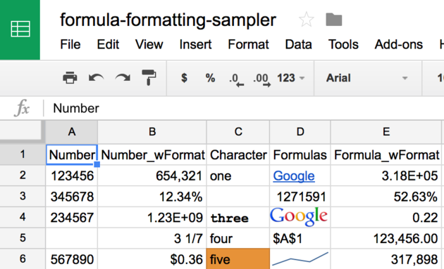

# Dealing with formulas and formatted numbers
Jenny Bryan  
`r Sys.Date()`  


### DRAFT DRAFT DRAFT

*This is me thinking out loud. It will eventually become a proper vignette.*

### Preliminaries

Load `googlesheets` and `dplyr`, from which we use the `%>%` pipe operator and which gives us nicer printing of data frames (`tbl_df`s)


```r
library(googlesheets)
#devtools::load_all()
suppressMessages(library(dplyr))
```


### Different notions of cell contents

When working with Google Sheets via [the cell feed](https://developers.google.com/google-apps/spreadsheets/data#work_with_cell-based_feeds), there are three ways to define cell contents:

  * **Literal value.** This is what hits your eyeballs when you view a Sheet in the browser. It's also what `googlesheets` returns now.
    - API docs: "The literal value of the cell element is the calculated value of the cell, without formatting applied. If the cell contains a formula, the calculated value is given here. The Sheets API has no concept of formatting, and thus cannot manipulate formatting of cells."
    - Google describes this as "the calculated value of the cell, without formatting applied" but that is misleading. The only formatting they mean to exclude here is decorative stuff, e.g., font size or cell background color. **Numeric formatting is very much in force**.
    - If cell contains a formula, this is the calculated result. Examples: an average of some other cells, a live hyperlink specified via `=HYPERLINK()`, an image specified via `=IMAGE()`.
    - If cell contains formatted numeric data, this is the formatted result. Examples: 2.35E+05, 12.34%, $112.03.
    - If cell contains a formatted numeric formula, this is the formatted, calculated result.
  * **Input value.** This is what was entered in the cell, with one gotcha.
    - API docs: "The `inputValue` attribute of a cell entry always contains the value that a user would otherwise type into the Google Sheets user interface to manipulate the cell (i.e. either a literal value or a formula)."
    - If cell contains a formula, this is the formula. If cell contains a string, this is the string. Easy.
    - If cell contains a number, this *generally* contains the number. Exception: a number formatted as a percentage. In this case Google assumes you know the spreadsheet data entry trick in which you type `0.12345%` to simultaneously enter the numeric value 0.12345 and format it as a percentage. Therefore, the numeric value 0.12345 will have input value `0.12345%` if formatted as a percentage and 0.12345 otherwise. Why, Google, why?
    - Empirically, input value seems to be what is displayed in the formula bar to the right of the $f_{x}$ when you visit a cell in the browser.
  * **Numeric value.**
    - API docs: "The `numericValue` attribute of a cell entry, when present, indicates that the cell was determined to have a numeric value, and its numeric value is indicated with this attributed."
    - If cell contains a number, this is that number.
    - If cell contains a numeric formula, this is the calculated numeric result.
    - Otherwise, the `numericValue` attribute doesn't even exist in the underlying XML and it will be an `NA` in any object `googlesheets` creates from reading the Sheet.

#### Vocabulary: there's formatting and then there's *formatting*

Click on the Format menu in Google Sheets and you'll gain access to a "Number" sub-menu and ... lots of other stuff. Let's agree that "formatting" can mean two different things:

  * Decoration. Font, font size, font color, bold, italic, cell background, text alignment, etc.
  * Numeric formatting. Meaning this:
    - UNformatted: 123456 or 32.61 or 0.53
    - Formatted: 123,456 or $32.61 or 53%

Decorative formatting is completely invisible to the Sheets API. It is also a terrible idea to encode data in decorative formatting, though it can be used to visually reinforce information that is properly stored in data (Google Sheets is capable of [conditional formatting](https://support.google.com/docs/answer/78413?hl=en)). Nothing in `googlesheets` or the rest of this vignette addresses decorative formatting. We shall not speak of it again. From now on, "formatting" means numeric formatting.

### A worthy challenge

We've created a formula and formatting ~~nightmare~~ sampler Sheet. [Go visit it in the browser!](https://docs.google.com/spreadsheets/d/19lRTCJDf9BYz9JepHx7y6u8vcxGbFpVSfIuxXnWpsL0). Or check out this screenshot.



Let's read it in various existing ways.


```r
## I can do this because I own the Sheet
## ffs <- gs_title("formula-formatting-sampler")
## but this should work for anyone
ffs <- gs_key("19lRTCJDf9BYz9JepHx7y6u8vcxGbFpVSfIuxXnWpsL0", lookup = FALSE)
#> Worksheets feed constructed with public visibility
(ffs_read_csv <- gs_read_csv(ffs))
#> Accessing worksheet titled 'Sheet1'.
#> No encoding supplied: defaulting to UTF-8.
#> Source: local data frame [5 x 5]
#> 
#>   Number Number_wFormat Character     Formulas Formula_wFormat
#>    (int)          (chr)     (chr)        (chr)           (chr)
#> 1 123456        654,321       one       Google        3.18E+05
#> 2 345678         12.34%        NA 1,271,591.00          52.63%
#> 3 234567       1.23E+09     three           NA            0.22
#> 4     NA          3 1/7      four         $A$1      123,456.00
#> 5 567890          $0.36      five           NA         317,898
(ffs_read_list <- gs_read_listfeed(ffs))
#> Accessing worksheet titled 'Sheet1'.
#> Source: local data frame [5 x 5]
#> 
#>   Number Number_wFormat Character     Formulas Formula_wFormat
#>    (int)          (chr)     (chr)        (chr)           (chr)
#> 1 123456        654,321       one       Google        3.18E+05
#> 2 345678         12.34%        NA 1,271,591.00          52.63%
#> 3 234567       1.23E+09     three           NA            0.22
#> 4     NA          3 1/7      four         $A$1      123,456.00
#> 5 567890          $0.36      five           NA         317,898
## SORRY FOLKS, until I close https://github.com/jennybc/googlesheets/issues/213
## other people can't download this sheet ... oops!
(ffs_download_csv <- gs_download(ffs,
                                 to = "formatted-numbers-and-formulas.csv",
                                 overwrite = TRUE) %>% 
  readr::read_csv())
#> Sheet successfully downloaded:
#> /Users/jenny/rrr/googlesheets/vignettes/formatted-numbers-and-formulas.csv
#> Source: local data frame [5 x 5]
#> 
#>   Number Number_wFormat Character     Formulas Formula_wFormat
#>    (int)          (chr)     (chr)        (chr)           (chr)
#> 1 123456        654,321       one       Google        3.18E+05
#> 2 345678         12.34%        NA 1,271,591.00          52.63%
#> 3 234567       1.23E+09     three           NA            0.22
#> 4     NA          3 1/7      four         $A$1      123,456.00
#> 5 567890          $0.36      five           NA         317,898
## This is a great opportunity to check uniformity of the new readr ingest.
identical(ffs_read_csv, ffs_read_list)
#> [1] TRUE
identical(ffs_read_csv, ffs_download_csv)
#> [1] TRUE
## YEESSSSSSS
```

What have we confirmed? That existing ways to read Sheets return the **literal values**.

What if you want unformatted numbers? What if you want the actual formulas? You must use the cell feed, which, in `googlesheets`, means you must use `gs_read_cellfeed()`.

### The cell feed

The Sheet reading done above -- via `gs_read_csv()`, `gs_read_list()`, and `gs_download(..., to = "foo.csv")` + csv import -- all assume that the data occupies a neat rectangle in the upper left corner, that you want all of it, and that you want the literal values.

What if you need more control over which cells? What if you want input or numeric values? Use the cell feed via `gs_read_cellfeed()`. This is what is happening under the hood when a cell range is provided to `gs_read()`, i.e. when the call is like `gs_read(..., range = "B4:D9")` or `gs_read(..., range = cell_cols(4:6))`.

Let's play with a modified version of `gs_read_cellfeed()`. As before, we return a data frame with one row per cell, but now we return all 3 notions of cell contents:

  * `literal_value`: The variable previously known as `cell_text`. What you see in the browser and what is returned by all other methods of reading.
  * `input_value`: What you would have typed into the cell (if you are a total spreadsheet nerd, when it comes to percentages).
  * `numeric_value`: The actual number, if such exists.


```r
cf <- gs_read_cellfeed(ffs)
#> Accessing worksheet titled 'Sheet1'.
cf_printme <- cf %>%
  arrange(col, row) %>%
  select(cell, literal_value, input_value, numeric_value)
```

Putting the screenshot in before and after the table of the cell contents, for my own convenience.


|cell |literal_value   |input_value                                             |numeric_value       |
|:----|:---------------|:-------------------------------------------------------|:-------------------|
|A1   |Number          |Number                                                  |NA                  |
|A2   |123456          |123456                                                  |123456.0            |
|A3   |345678          |345678                                                  |345678.0            |
|A4   |234567          |234567                                                  |234567.0            |
|A6   |567890          |567890                                                  |567890.0            |
|B1   |Number_wFormat  |Number_wFormat                                          |NA                  |
|B2   |654,321         |654321                                                  |654321.0            |
|B3   |12.34%          |12.34%                                                  |0.1234              |
|B4   |1.23E+09        |1234567890                                              |1.23456789E9        |
|B5   |3 1/7           |3.14159265359                                           |3.14159265359       |
|B6   |$0.36           |0.36                                                    |0.36                |
|C1   |Character       |Character                                               |NA                  |
|C2   |one             |one                                                     |NA                  |
|C4   |three           |three                                                   |NA                  |
|C5   |four            |four                                                    |NA                  |
|C6   |five            |five                                                    |NA                  |
|D1   |Formulas        |Formulas                                                |NA                  |
|D2   |Google          |=HYPERLINK("http://www.google.com/","Google")           |NA                  |
|D3   |1,271,591.00    |=sum(R[-1]C[-3]:R[3]C[-3])                              |1271591.0           |
|D4   |                |=IMAGE("https://www.google.com/images/srpr/logo3w.png") |NA                  |
|D5   |$A$1            |=ADDRESS(1,1)                                           |NA                  |
|D6   |                |=SPARKLINE(R[-4]C[-3]:R[0]C[-3])                        |NA                  |
|E1   |Formula_wFormat |Formula_wFormat                                         |NA                  |
|E2   |3.18E+05        |=average(R[0]C[-4]:R[4]C[-4])                           |317897.75           |
|E3   |52.63%          |=R[-1]C[-4]/R[1]C[-4]                                   |0.5263144432081239  |
|E4   |0.22            |=R[-2]C[-4]/R[2]C[-4]                                   |0.21739421366813996 |
|E5   |123,456.00      |=min(R[-3]C[-4]:R[1]C[-4])                              |123456.0            |
|E6   |317,898         |=average(R2C1:R6C1)                                     |317897.75           |


### Proposed uses of the new cell contents

Consider a formatted numeric column. In some cases, the existing read methods will return character when really they should not. What is the right way to offer user the option of populating that column with `numeric_value` and getting a proper numeric variable?

Proposed logic for optionally redefining cell contents, prior to reshaping/simplification and type conversion:

  * If there is no numeric value, take the literal value. If there is ... take numeric value instead. Except when that would make an integers look like a double. In that case, take input value.

Anyone who wants formulas = `input_value` can work directly with cell feed and doesn't get reshaping. I don't think they would want it anyway?

Exploring this with the sampler Sheet.

Here's column 2, `Number_wFormat`, which holds formatted numbers. Compare `literal_value` (current default) and `numeric_value` (what people probably want). Except when an integer gains a `.0`. Then we probably want `input_value`, for type conversion purposes. And note what's going on with `numeric_value` for scientific notation.


```r
cf %>%
  filter(col == 2) %>%
  select(literal_value, input_value, numeric_value)
#> Source: local data frame [6 x 3]
#> 
#>    literal_value    input_value numeric_value
#>            (chr)          (chr)         (chr)
#> 1 Number_wFormat Number_wFormat            NA
#> 2        654,321         654321      654321.0
#> 3         12.34%         12.34%        0.1234
#> 4       1.23E+09     1234567890  1.23456789E9
#> 5          3 1/7  3.14159265359 3.14159265359
#> 6          $0.36           0.36          0.36
```

Here's column 4, `Formulas`, which has a bunch of formulas, which show up as such in `input_value`. *Note we had to truncate `input_value` a wee bit for printing purposes.*


```r
cf %>%
  filter(col == 4) %>%
  select(literal_value, input_value, numeric_value) %>% 
  mutate(input_value = substr(input_value, 1, 54))
#> Source: local data frame [6 x 3]
#> 
#>   literal_value                                            input_value
#>           (chr)                                                  (chr)
#> 1      Formulas                                               Formulas
#> 2        Google          =HYPERLINK("http://www.google.com/","Google")
#> 3  1,271,591.00                             =sum(R[-1]C[-3]:R[3]C[-3])
#> 4               =IMAGE("https://www.google.com/images/srpr/logo3w.png"
#> 5          $A$1                                          =ADDRESS(1,1)
#> 6                                     =SPARKLINE(R[-4]C[-3]:R[0]C[-3])
#> Variables not shown: numeric_value (chr).
```

Here's column 5, `Formula_wFormat`, which has a bunch of formatted numeric formulas. Compare `literal_value` (current default) and `numeric_value` (what people want) and `input_value` (the actual formulas).


```r
cf %>%
  filter(col == 5) %>%
  select(literal_value, input_value, numeric_value)
#> Source: local data frame [6 x 3]
#> 
#>     literal_value                   input_value       numeric_value
#>             (chr)                         (chr)               (chr)
#> 1 Formula_wFormat               Formula_wFormat                  NA
#> 2        3.18E+05 =average(R[0]C[-4]:R[4]C[-4])           317897.75
#> 3          52.63%         =R[-1]C[-4]/R[1]C[-4]  0.5263144432081239
#> 4            0.22         =R[-2]C[-4]/R[2]C[-4] 0.21739421366813996
#> 5      123,456.00    =min(R[-3]C[-4]:R[1]C[-4])            123456.0
#> 6         317,898           =average(R2C1:R6C1)           317897.75
```

Logic in the experimental new version of `gs_reshape_cellfeed()`:

  * Create an indicator for: does `numeric_value` exist?
  * Create an indicator for: does this look like an integer that is at risk of looking like a double if we take `numeric_value`?
  * Create new putative cell content like so:
    - if `numeric_value` does not exist, use `literal_value` (business as usual)
    - else if it's an "at risk" integer, use `input_value`
    - else use `numeric_value`
  * Isolate, reshape and type convert THAT
  
Set the new argument `literal = FALSE` to try this out:


```r
how_about_this <- cf %>%
  gs_reshape_cellfeed(literal = FALSE)
how_about_this
#> Source: local data frame [5 x 5]
#> 
#>   Number Number_wFormat Character  Formulas Formula_wFormat
#>    (int)          (dbl)     (chr)     (chr)           (dbl)
#> 1 123456   6.543210e+05       one    Google    3.178978e+05
#> 2 345678   1.234000e-01        NA 1271591.0    5.263144e-01
#> 3 234567   1.234568e+09     three        NA    2.173942e-01
#> 4     NA   3.141593e+00      four      $A$1    1.234560e+05
#> 5 567890   3.600000e-01      five        NA    3.178978e+05
ffs_read_csv
#> Source: local data frame [5 x 5]
#> 
#>   Number Number_wFormat Character     Formulas Formula_wFormat
#>    (int)          (chr)     (chr)        (chr)           (chr)
#> 1 123456        654,321       one       Google        3.18E+05
#> 2 345678         12.34%        NA 1,271,591.00          52.63%
#> 3 234567       1.23E+09     three           NA            0.22
#> 4     NA          3 1/7      four         $A$1      123,456.00
#> 5 567890          $0.36      five           NA         317,898
```

What do we think? Top is what we get when we remove numeric formats before type conversion. Bottom is what current read methods return.

While I'm at it, let's see if I've got `gs_simplify_cellfeed()` working again.


```r
cf_E <- gs_read_cellfeed(ffs, range = cell_cols("E"))
#> Accessing worksheet titled 'Sheet1'.
cf_E %>% gs_simplify_cellfeed()
#>           E2           E3           E4           E5           E6 
#>   "3.18E+05"     "52.63%"       "0.22" "123,456.00"    "317,898"
cf_E %>% gs_simplify_cellfeed(literal = FALSE)
#>           E2           E3           E4           E5           E6 
#> 3.178978e+05 5.263144e-01 2.173942e-01 1.234560e+05 3.178978e+05
```


